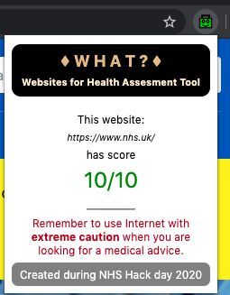

# Websites for Health Assesment Tool

This is repository for the WHAT project that aims to help users make sense in an online medical information jungle.

## Why?

According to the [Office National Statistics](https://www.ons.gov.uk/peoplepopulationandcommunity/householdcharacteristics/homeinternetandsocialmediausage/bulletins/internetaccesshouseholdsandindividuals/2019) 54% of people in the UK are looking for health related information online. The figures vary worldwide, but in USA it might be even 80% according to [NBC](http://www.nbcnews.com/id/3077086/t/more-people-search-health-online/). More: https://www.nature.com/news/2004/040802/full/040802-3.html

**Not all the medical information sources can be trusted.**

## How?

We propose a web-browser plugin that warns you if the website, that you visit searching for healthcare related content, cannot be trusted. You can download it from [Chrome Web Store](https://chrome.google.com/webstore/detail/what-websites-for-health/maoedkipekbhpphphjmnmoccdgkkahfn).

## Medical sources trust assessment

The scores are calculated as a weighted average of internet users and medical expert responses.

If you want to help us assess credibility of medical sources, please visit this website: https://dokato.shinyapps.io/WHAT/

## Technological stack

R + Shiny + mongoDB + JavaScript

### Credits

[dokatox](https://twitter.com/dokatox), [_katriona](https://twitter.com/_katriona), [AlishaDavies1](https://twitter.com/AlishaDavies1), [tomchambers6](https://twitter.com/tomchambers6), [NiaRCampbell](https://twitter.com/NiaRCampbell), [MarkJam3s](https://twitter.com/MarkJam3s)

The project was made at [NHS Hack Day](https://nhshackday.com/events/2020/01/cardiff) in Cardiff, January 2020.

